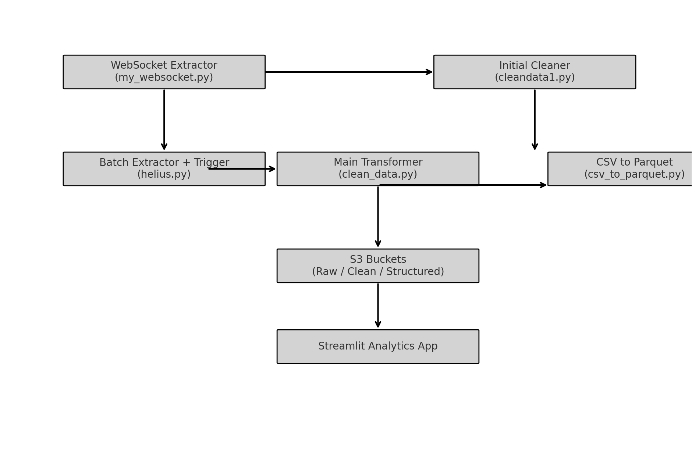

# 🔁 Solana Token Launch ETL Pipeline

**Deployed:** AWS | **Date:** March 22, 2025  
**Tech Stack:** Python, WebSockets, AWS S3, Helius API, Streamlit, Parquet

---

## 📦 ETL Breakdown

### 1. `my_websocket.py` – Extract
- Listens to real-time WebSocket data (token launches/liquidity events)
- Enriches and stores raw JSON to `s3://<your-bucket>/raw/`
- **[API keys redacted]**

### 1a. `cleandata1.py` – Initial Transform
- Extracts mint address, token name, ticker, and launch marketcap
- Outputs CSV format to `s3://<your-bucket>/clean/cleandata1/`

### 2. `helius.py` – Batch Extract + Trigger
- Pulls on-chain tx data for known mints via Helius API
- Skips already-processed entries by checking S3 state
- Triggers downstream scripts
- **[API keys redacted]**

### 3. `clean_data.py` + `csv_to_parquet.py` – Transform & Load
- Cleans/normalizes fields, converts timestamps, removes dups
- Outputs Parquet to `s3://<your-bucket>/structured/parquet/` (Athena-ready)

### 4. Streamlit Dashboard – Analytics Layer
- Consumes final dataset
- Displays risk scores and heuristics
- Enables near real-time UI interaction with launch data

---

## 📁 AWS Notes

- **S3:** All ETL stages write to S3 (raw, intermediate, structured)
- **Triggering:** Manual or scheduled (supports AWS Lambda or local crontab)
- **Downstream Analytics:** Designed for Athena queries or BI dashboards

---

## 🔍 Architecture Diagram

---

## 🛑 Security Notice

All API keys and credentials are redacted. Ensure proper use of `.env` and `.gitignore` in your deployment.
# solana-etl-pipeline
